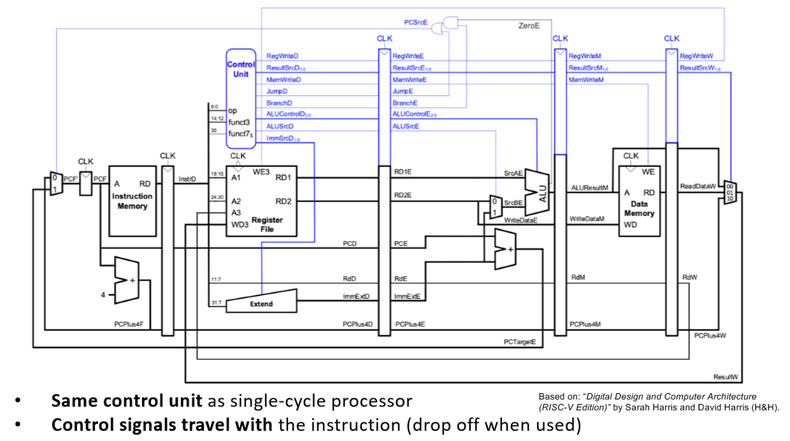
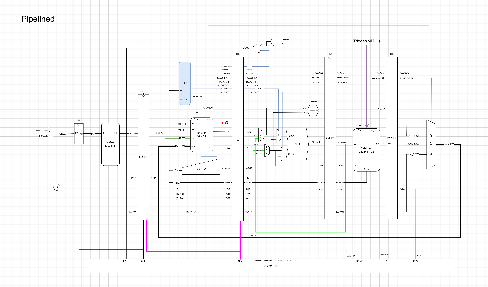
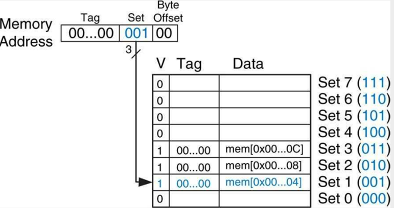
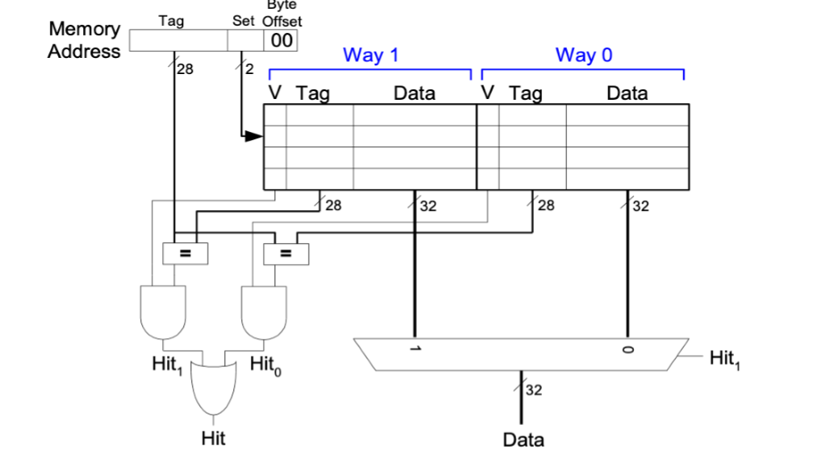
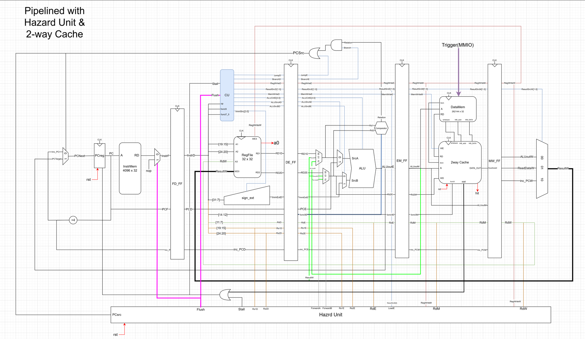

# RISC-V RV32I Processor

## Introduction
This repo contains our RISC-V CPU, for single cycle implementation, pipelined, and pipelined with cache. The CPU passes the test cases.


### Team 12 members:

| Name   | Personal Statements |    
|------------|-----------------|
| Abraham Lin - Git Master | add link |      
| Charlotte Maxwell | add link|
| Shravan Kumar     |add link |
| Shreeya Agarwal   |add link |


### Team Contributions

#### Single Cycle
| Component               | Shreeya Agarwal | Shravan Kumar | Charlotte Maxwell | Abraham Lin |
|-------------------------|-----------------|---------------|-------------------|-------------|
| **PC**                  | *               | *             | *                 | *           |
| **ALU**                 |                 |               |                   | *           |
| **Register File**       | *               |               |                   |             |
| **Instruction Memory**  |                 | *             |                   |             |
| **Control Unit**        |                 | *             |                   |             |
| **Sign Extend**         | *               |               |                   | *           |
| **Data Path**           |                 | *             | *                 | *           |
| **Data Memory**         |                 |               | *                 |             |
| **Datapath**            |                 | *             | *                 | *           |
| **Top Level Assembly**  | *               | *             | *                 | *           |
| **Testbenches**         |                 |               |                   | *           |
| **F1.s**                | *               |               |                   | *           |

---

#### Pipelining
| Component                     | Shreeya Agarwal | Shravan Kumar | Charlotte Maxwell | Abraham Lin |
|-------------------------      |-----------------|---------------|-------------------|-------------|
| **FF1**                       | *               | *             |                   | *           |
| **FF2**                       | *               | *             |                   | *           |
| **FF3**                       | *               | *             |                   | *           |
| **FF4**                       | *               | *             |                   |             |
| **Hazard Unit**               | *               |               |                   | *           |
| **Fetch Implementation**      |                 | *             |                   |             |
| **Decode Implementation**     |                 | *             |                   |             |
| **Execute Implementation**    |                 | *             |                   |             |
| **Memory Implementation**     |                 | *             |                   |             |
| **WriteBack Implementation**  |                 | *             |                   |             |
| **Top Implementation**        |                 | *             |                   | *           |
| **Testbench**                 |                 |               |                   | *           |

---

#### Pipelining with Cache
| Component                                 | Shreeya Agarwal | Shravan Kumar | Charlotte Maxwell | Abraham Lin |
|-------------------------------------------|-----------------|---------------|-------------------|-------------|
| **Direct Mapped Cache**                   |                 |               | *                 |             |
| **2-Way Set Associative Cache**           |                 |               | *                 | *           |
| **memory and top update for 2 way cache**   | *               |               |                   |             |

The CPU diagrams as seen in the following document were designed by Abraham.

Note that as team members all frequently met up together, the above table and commits do not accurately represent the individual contribution of team members as:

 - When working together, pushes were often committed from one laptop to avoid issues with git, and to have tests and diagrams open on others. As such, some commits are a combined effort of 2 or more members
- Some commits may be small mistakes which have taken hours to debug, as a combined effort of 2 or more team members, especially when it came to implementation
- Certain commits were overwritten by members having to upload a new file in its place due to issues with Git

Note, the diagrams of the CPU in this document were designed by Abraham.


For Lab 4 information, see [Lab_4](./Specifications//Lab_4.md).

### Evidence of a Working Processor

See the following videos, for the F1 program, and the 4 waveform PDF programs.

| Dataset        | Gaussian |  Triangle |  Sine | Noisy | 
|--------|------------|------------|------------|--------------|
| **Graphs**|  pic1         | pic2          | pic3          |pic4
| 

### Video Evidence

**F1 Lights**

**Gaussian**

**Sine**

**Triangle**

**Noisy**

=======


# Single Cycle Version

## Introduction

Building up on lab 4, we implemented the single cycle version. The main challenge was implementing all the instructions, and the addition of the new data memory.

## Design Specification

The textbook and lecture slides recommended to use the following diagram: 


Following the project brief after lab 4, the main requirements we had were:

 - Changes in the control unit to implement all the instructions in the control unit (e.g. JAL, Load, Store)
 - coming up with the machine code to implement the F1 light cycle
 - Adding a Data Memory and a Multiplexor, and the logic for adding

 (add in any other relevant changes and sections on datamem/cu)

 We adapted this to the following diagram. The main changes made was:

 - addition of a comparator
- *ALU*: adding the load immediate instruction to the ALU
- *Top Level module checks and testing*: Ensuring Variable names are consistent, debugging, and simulating on GTKWave to check the machine code works and was implemented properly.
 
 and the inputs to the following modules (insert) to implement (insert the following changes)


 ### Data Memory

 

The memory map shows that the data memory goes from 0x01000 to 0x1FFFF, so we needed ${2^{17}}$ addresses leading to the initialisation of our data memory.

```systemverilog
// Memory array: 2^17 locations 0x00000000 to 0x0001FFFF, each MEM_WIDTH bits wide
    logic [MEM_WIDTH-1:0] mem [0:2**17-1];

    initial begin
        $readmemh("data.hex", mem, 32'h00010000);
        $display("Data Memory Contents After Initialization:");
        $display("mem[0] = %h", mem[32'h00010000]);
        $display("mem[1] = %h", mem[32'h00010001]);
        $display("mem[2] = %h", mem[32'h00010002]);
        $display("mem[3] = %h", mem[32'h00010003]);
    end

```
We then implemented load and store instructions for the single cycle. Specifically, we ensured to handle the logic for reading from and writing to memory, with support for byte, half-word, and word accesses. Whether it's signed or notis determined by the `funct3`  field in the instruction.

**The Read Logic for Load Instructions**

This block defines how data is read from the memory during load instructions, based on the instruction's `funct3` field and the address `A`. 

If the address `A` equals `32'h000000FC`, the code fetches the value of the trigger signal, and places it in the LSB of `RD`. This is for hardware functionality. If the address doesn't match the MMIO range, the code uses a `case` statement to determine how to fetch data based on `funct3 `.

```systemverilog
 // Read logic for load instructions
    always_comb begin
        if (A == 32'h000000FC) begin
            // MMIO read from trigger address
            RD = {31'b0, trigger};  // Return trigger in LSB
        end 
        else begin
            // Regular memory read 
            case (funct3)
                3'b000: RD = {{24{mem[A][7]}}, mem[A]};                 // lb
                3'b001: RD = {{16{mem[A+1][15]}}, mem[A+1], mem[A]};    // lh
                3'b010: RD = {mem[A+3], mem[A+2], mem[A+1], mem[A]};    // lw
                3'b100: RD = {24'b0, mem[A]};                           // lbu
                3'b101: RD = {16'b0, mem[A+1], mem[A]};                 // lhu
                default: RD = 32'b0;                                    // Default case
            endcase
```
**Write Logic for Store Instructions**
 
This block defines how data is written to memory during store instructions, based on the instruction's `funct3` field and the address `A`. 

```systemverilog
always_ff @(posedge clk) begin
    if (WE) begin // Store instruction
        case (funct3)
            3'b000: mem[A] <= WD[7:0];      // sb
            3'b001: begin
                mem[A + 1] <= WD[15:8];     // sh
                mem[A] <= WD[7:0];
            end
            3'b010: begin
                mem[A + 3] <= WD[31:24];    // sw
                mem[A + 2] <= WD[23:16];
                mem[A + 1] <= WD[15:8];
                mem[A] <= WD[7:0];
            end

```

We see the memory writes are only performed if `WE` signal is active, and the `case` statement determines how to write data to the memory (`WD`) based on `funct3`.


 ### Control Unit

 **Control unit**:
 
 

**Instruction list implemented**:
 

The *CU* generates control signals based on:
-  `op` (used to determine the instruction type)
- `funct3` (to determine specific operations within an instruction e.g. ALU operations)
- `funct7_5` (A part of the instruction, used in some R-type instructions to differentiate between operations (e.g., add vs. subtract)). 

The `always_comb` block executes whenever any of the input signals change. This block generates control signals based on the `op` and `funct3` values. We ensured to initialise all the values.

This code generates control signals for a RISC-V processor based on the instruction opcode (`op`) and the function fields (`funct3`, `funct7_5`). These control signals drive the ALU, memory, register file, and branching mechanisms, enabling the processor to execute the appropriate operation for each instruction type.


 ### Simulation and Testing

 For our single cycle, we wrote unit testbenches (link) to ensure all the modules were working accurately, and to isolate errors for easier debugging.

 (did we also use industry standard GTest?)

 This allowed us to check the expected behaviour of each control/data path signal in a module. (insert picture of it passing)

 The definition of the feedback can be found in the `doit.sh` file. 

 The bash scripts (what are they called? compile and doit?) help compile and assemble the `c` and `asm` tests in the testbench. (add any extra details)

 # Pipelined Version

## Introduction
Based on our single-cycle implementation, we built up on it to build the pipelined version. The main challenges were splitting up the design into 5 stages: fetch, decode, execute, memory, writeback. The addition of the flip flops and the hazard unit was also an interesting design challenge.

## Design Specifications

The textbook and lecture slides recommended we use the following diagram:



We adapted this to the following diagram. The main changes we implemented were:
 - The addition of 4 flip flops
 - Hazard Unit to implement flush and stall logic for instructions
 - splitting up the implementation into the 4 stages (`fetch`, `decode`, `memory`, `execute`) and then adapting the `top.sv` file to combine the logic
 - A trigger signal coming into the Data Memory

 

 Since the control unit needed no major adaptations following single cycle, implementation of pipelining was smooth, especially as tackling it in 4 separate stages and combining it in the `top` file made debugging and keeping track of all the inputs and outputs easier.

 In the `Hazard Unit` we had to implement methods to combat `RAW dependency hazard`, `LW dependency hazard`, and `control hazards` which were caused by branch and jumping.

 ## Data Hazard Detection

In the hazard unit, we handled data hazards by determining when *stalling* or *forwarding* was necessary. The main goal was to ensure the processor handles the cases where the instructions depend on data that is yet to be written back (e.g. when the result of one instruction is needed by another instruction before it's available).

**Initial Inputs**

```systemverilog
    //default outputs
    Stall = 1'b0;
    Flush = (PCSrc || rst) ? 1'b1: 1'b0; // Flush if jumping happen (next PC not PC+4)
    ForwardA = 2'b00;
    ForwardB = 2'b00;
```
- `Stall`: indicates if its stalled or not (i.e. no new instructions should proceed to the next stage). This is so if a load instruction’s result is needed by a following instruction, the pipeline is stalled to wait for the load instruction to complete.
- `Flush`: Determined if the pipeline should be cleared of its current state - occurs when there's jumping/branching
- `ForwardA` and `ForwardB`: selects where to forward the data from the source registes (`RS1` and `RS2`)

**Forwarding**

```systemverilog
if (RegWriteM && (RdM == Rs1E) && (Rs1E != 5'b00000)) begin
    ForwardA = 2'b10; //forward from MEM stage if not Load; result ready as ALUoutM
end
else if (RegWriteW && (RdW == Rs1E) && (Rs1E != 5'b00000)) begin
    ForwardA = 2'b01; //forward from WB stage
end
```
This part checks if the value of register `Rs1` (used in the current instruction at `EX` stage) is being written back in the `MEM` or `WB` stages

If the instruction in the `MEM` stage is writing to the same register `Rs1E`, the result is forwarded from the `MEM` stage (using `ALUoutM`), so `ForwardA = 2'b10`. If the instruction in the `WB` stage writes to `Rs1E`, the result is forwarded from the `WB` stage, so `ForwardA = 2'b01`.

A similar logic applies for the forwarding od `Rs2E`.

**Stall Conditions**
```systemverilog
if(LoadE && ((RdE == Rs1D) || (RdE == Rs2D)))
    Stall = 1'b1;
```
This part detects load-use hazards, which occur when a load instruction is followed by an instruction that depends on the value being loaded.

The Stall and Flush logic was then added to the 4 flip flops, and all of this was combined into our `top.sv` file.

# Pipelined with Cache

## Introduction
Cache was introduced to have a faster access to memory with limited storage accessible to the processor.

## Direct Mapped Cache
.

We first implemented a direct-mapped cache by following the recommended structure of the textbook; this contained a cache line of 60 bits.

- 32 (LSB) assigned to `DATA`
- 27 (NSB) assigned to `TAG`
- 1 (MSB) assigned to `VALID`

This cache line maps to the memory addressing of the cache as:

- [0:1] in the `BYTE OFFSET` to accomodate word and byte addressing
- [2:4] in the `SET` to establish and index the cache storage in the memory
- [5:31] in the `TAG` to identify data stored in the direct-mapped memory.

**Cache Structure**
 ```systemverilog
 typedef struct packed {
    logic ValitdityBit;
    logic [26:0] tag;
    logic [DATA_WIDTH-1:0] data; 
} CacheType;

CacheType cache [8]; // define 8 set cache

 ```

 This defines the structure for each cache entry, where:
 - `ValidityBit` inidicates if the entry is valid or not
 - `tag` determines if the cache entry matches the requested address
 
 This formes an araay of 8 cache entries, where each address maps to a unique cache set.

 **Cache Read Logic**

 ```systemverilog
 logic [DATA_WIDTH-1:0] RD;
logic [26:0] tag;
logic [2:0] set;

always_comb begin
    tag = address[31:5];
    set = address[4:2];
    
    if(cache[set].ValitdityBit && (cache[set].tag == tag)) begin
        hit = 1;
        CacheData = cache[set].data;
    end
    else begin
        hit = 0;
        CacheData = CacheMissData_RMM;
    end
end
```
The **cache read logic** checks if the requested address is in the cache by comparing the tag and checking if the cache entry is valid.
If the data is found in the cache (hit), it is returned immediately; otherwise, the data from the main memory is returned (miss).
The **cache write logic** writes data into the cache only if there’s a miss and the write enable signal (WE) is active.

## 2 way Set Associative Cache

The *set-associative cache* improves upon the direct-mapped cache by allowing multiple data blocks to reside in the same cache set, reducing conflict misses and improving overall cache hit rates. It also incorporates write-back policy, dirty bits, and LRU replacement. We followed the logic of the diagram provided in the textbook and lecture slides:



This was our final CPU design with the 2 way set-associative cache implemented.


### The key differences are as follows:

**1) Mapping**
 - *Direct-Mapped Cache*:  each memory block can be placed in only one specific cache line, determined by the address. If there’s a conflict (i.e., multiple memory blocks map to the same cache line), only one block can reside in that cache line at a time, resulting in a cache miss. 
 - *Set-Associative Cache*: each memory block can be placed in any of several lines (sets) in the cache. The number of lines in a set is determined by the associativity of the cache. Here, we can hold 2 different blocks of data

 **2) Cache Lookup**
 - *Direct-Mapped*: a single tag comparison per cache line determines if its a hit or a miss
 - *Set-Associative Cache*: here, 2 ways are checked for a cache hit (each set can hold 2 memory blocks). This increases the hit probability.

 **3) Replacement Policy**
 - *Direct-Mapped*: there is no choice of which cache line to evict in case of a miss because each block maps to a specific cache line.
 - *Set-Associative Cache*: when a miss occurs and the set is full, the cache has to choose one of the ways to evict. In this code, the LRU (Least Recently Used) policy is used to decide which way to evict, using the `U` bit to track which way was last used.

 **Cache Structure**

 ```systemverilog
     typedef struct packed {
        logic U; // LRU bit -- 1 = [Way 0 recently used]; 0 = [Way 1 recently used] => should write to the other way
        // Way 1
        logic ValitdityBit1;
        logic DB1; // Dirty bit
        logic [27:0] tag1;
        logic [DATA_WIDTH-1:0] data1; 

        // Way 0
        logic ValitdityBit0;
        logic DB0; // Dirty bit
        logic [27:0] tag0;
        logic [DATA_WIDTH-1:0] data0; 
    } CacheType;
    
```
The cache is organised into 4 sets, each of which has 2 slots for storing data. Since the number of locations mapped to each cache line has doubled, the `TAG` is now 28 bits instead of 27.

`U` is the bit indicating the *LRU* state. The dirty bits `DB0`, `DB1` indicate if the data in the cache line is modified and needs to be written back to memory.

**Cache Access**

The logic will check if the address matches any of the 2 possible ways in the selected set (`Way0` or `Way1`). This triggers the `hit` and `stall` signals according to if there's a *miss* or a *hit*.

**Write-Back and Write-Allocate Policies**

If the cache line is evicted and the data is dirty, it's written back the main memory.

On a write miss, data is fetched from the memory into cache, before the write operation is performed.

**LRU Logic**

The `U` bit is used to keep track of which way was last used. After a cache hit, the `U` bit is updated to indicate the least recently used way. This allows the system to evict the least recently used way when a miss occurs and both ways in the set are occupied.

**Memory-Mapped I/O (MMIO)**

The cache handles MMIO accesses, where the address `0x000000FC` is specifically designated for memory-mapped I/O. When an address matches this, the cache directly outputs `RD` (read data from memory) without any cache lookup.

**Read/Write Operations**
- *Read*: If the cache contains the data, it's returned based on the `funct3` value, which determines the load type (e.g., byte, halfword, word). 
- *Write*: On a write miss, the cache fetches the data from memory and updates the cache accordingly. The `funct3` value determines the type of store (byte, halfword, or word).

**Reset Functionality**

On the `rst`, all cache entries are cleared, and the validity bits and dirty bits are reset to their default values.

(if we want a shorter summary for this)
Address Breakdown: The input address is parsed to determine the cache set and tag.
Cache Access: The system checks both ways in the selected set to see if the requested data is present. If not, it triggers a stall and handles cache miss logic (write-back or fetch).
Write-back & LRU Update: When writing or evicting data, the LRU bit (U) is updated to track the most recently used way. If the cache is full, the least recently used way is evicted.
Cache Read and Write Handling: The system handles different load and store operations (e.g., byte, halfword, word), managing the data accordingly.
MMIO Access: Specific memory-mapped I/O addresses bypass the cache and provide direct memory access.