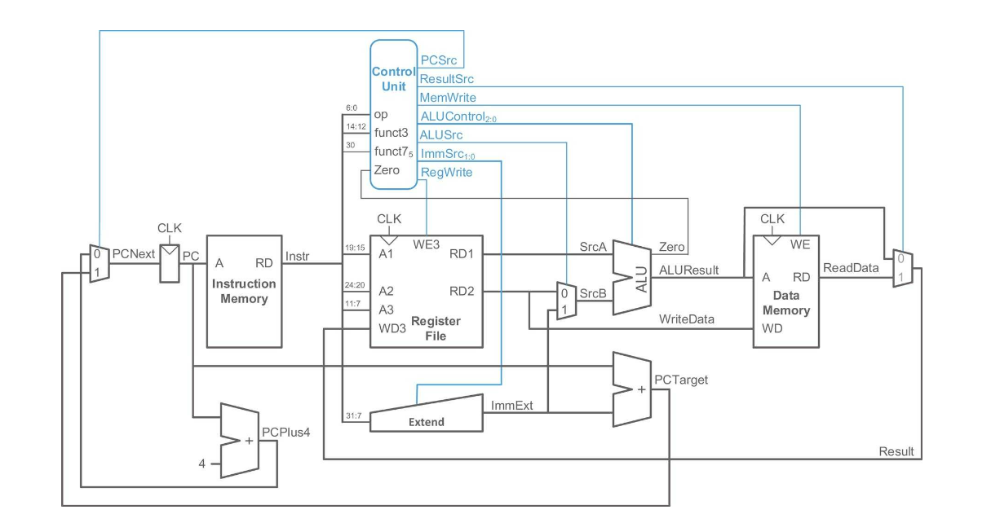
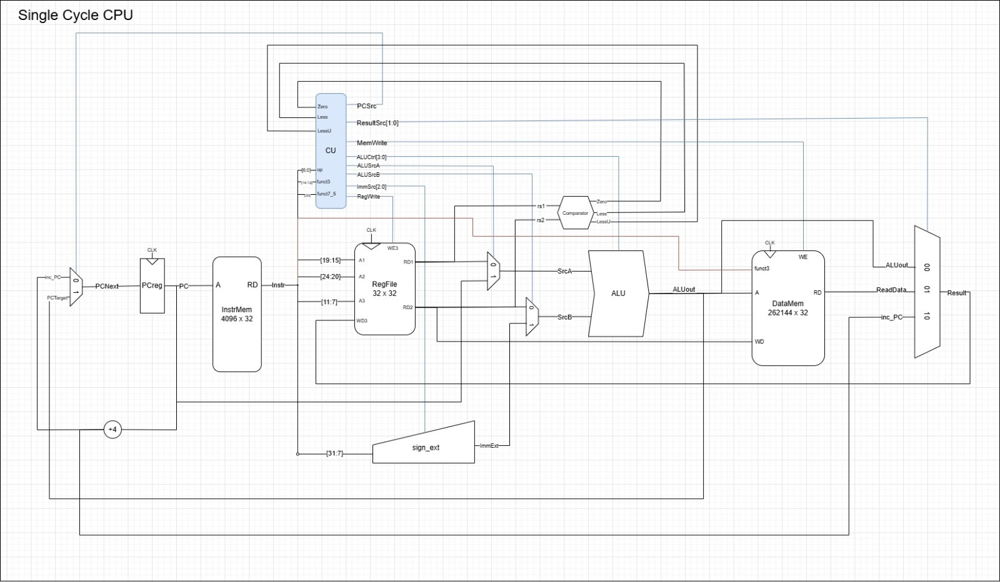
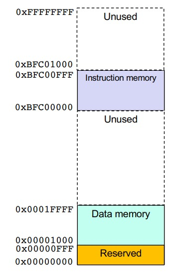
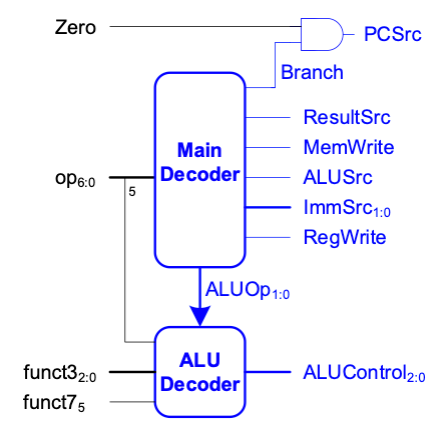
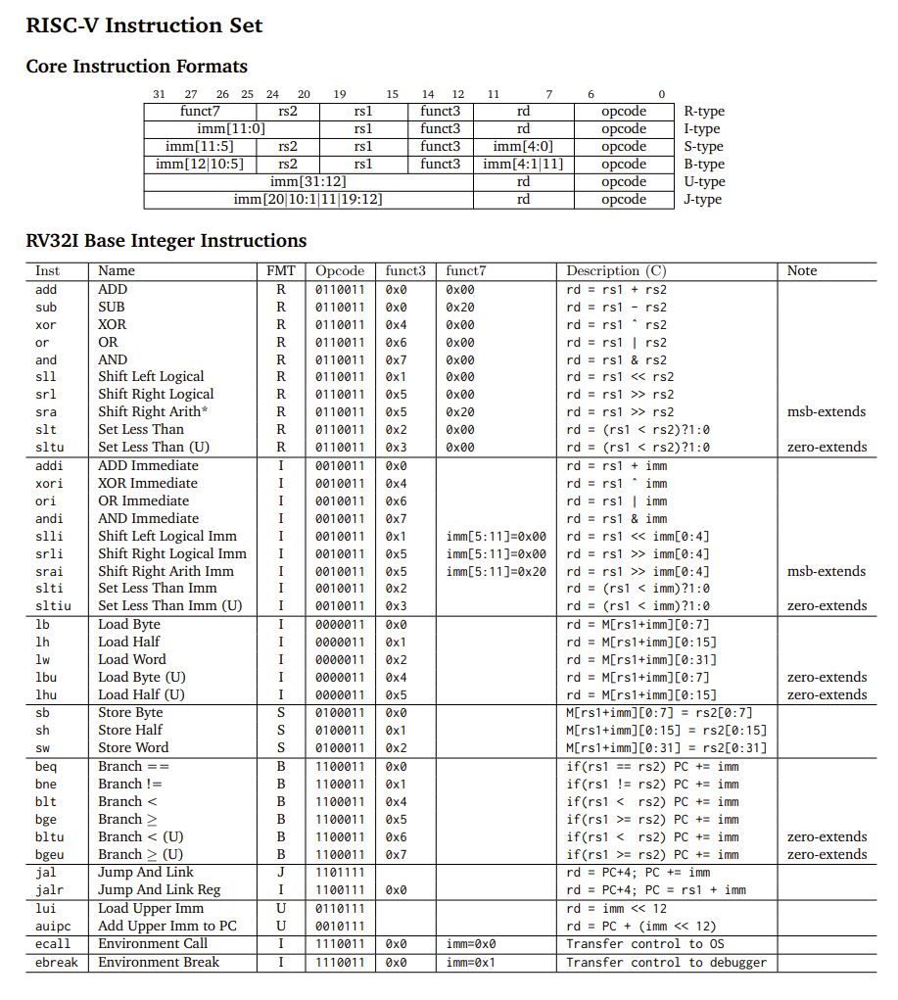

# RISC-V RV32I Processor

## Introduction
This repo contains our RISC-V CPU, for single cycle implementation, pipelined, and pipelined with cache. The CPU passes the test cases.

### Team 12 members:

| Name   | Personal Statements |    
|------------|-----------------|
| Abraham Lin - Git Master | add link |      
| Charlotte Maxwell | add link|
| Shravan Kumar     |add link |
| Shreeya Agarwal   |add link |

### Team Contributions

#### Single Cycle
| Component               | Shreeya Agarwal | Shravan Kumar | Charlotte Maxwell | Abraham Lin |
|-------------------------|-----------------|---------------|-------------------|-------------|
| **PC**                  | *               | *             | *                 | *           |
| **Register File**       | *               |               |                   |             |
| **Instruction Memory**  |                 | *             |                   |             |
| **Control Unit**        |                 | *             |                   |             |
| **Sign Extend**         | *               |               |                   | *           |
| **Data Path**           |                 | *             | *                 | *           |
| **ALU**                 |                 |               |                   | *           |
| **Comparator**          |                 |               |                   | *           |
| **Data Memory**         |                 |               | *                 |             |
| **Datapath**            |                 | *             | *                 | *           |
| **Top Level Assembly**  | *               | *             | *                 | *           |
| **Testbenches**         |                 |               |                   | *           |
| **F1.s**                | *               |               |                   | *           |

---

#### Pipelining
| Component                     | Shreeya Agarwal | Shravan Kumar | Charlotte Maxwell | Abraham Lin |
|-------------------------      |-----------------|---------------|-------------------|-------------|
| **FF1**                       | *               | *             |                   | *           |
| **FF2**                       | *               | *             |                   | *           |
| **FF3**                       | *               | *             |                   | *           |
| **FF4**                       | *               | *             |                   |             |
| **Hazard Unit**               | *               |               |                   | *           |
| **Fetch Implementation**      |                 | *             |                   |             |
| **Decode Implementation**     |                 | *             |                   |             |
| **Execute Implementation**    |                 | *             |                   |             |
| **Memory Implementation**     |                 | *             |                   |             |
| **WriteBack Implementation**  |                 | *             |                   |             |
| **Top Implementation**        |                 | *             |                   | *           |
| **Testbench**                 |                 |               |                   | *           |

---

#### Pipelining with Cache
| Component                       | Shreeya Agarwal | Shravan Kumar | Charlotte Maxwell | Abraham Lin |
|---------------------------------|-----------------|---------------|-------------------|-------------|
| **Direct Mapped Cache**         |                 |               | *                 |             |
| **2-Way Set Associative Cache** |                 |               | *                 |             |

Note that as team members all frequently met up together, the above table and commits do not accurately represent the individual contribution of team members as:

 - When working together, pushes were often committed from one laptop to avoid issues with git, and to have tests and diagrams open on others. As such, some commits are a combined effort of 2 or more members
- Some commits may be small mistakes which have taken hours to debug, as a combined effort of 2 or more team members, especially when it came to implementation
- Certain commits were overwritten by members having to upload a new file in its place due to issues with Git

For Lab 4 information, see [Lab_4](./Specifications//Lab_4.md).

### Evidence of a Working Processor

See the following videos, for the F1 program, and the 4 waveform PDF programs.

| Dataset        | Gaussian |  Triangle |  Sine | Noisy | 
|--------|------------|------------|------------|--------------|
| **Graphs**|  pic1         | pic2          | pic3          |pic4
| 

### Video Evidence

**F1 Lights**

**Gaussian**

**Sine**

**Triangle**

**Noisy**

=======

# Single Cycle Version

## Introduction

Building up on lab 4, we implemented the single cycle version. The main challenge was implementing all the instructions.

## Design Specification

The textbook and lecture slides recommended to use the following diagram: 

We adapted this to the following diagram. The main changes made was the addition of a comparator, and the inputs to the following modules (insert) to implement (insert the following changes)

Following the project brief after lab 4, the main requirements we had were:

 - Changes in the control unit to implement all the instructions
 - coming up with the machine code to implement the F1 light cycle

 (add in any other relevant changes and sections on datamem/cu)

 ### Data Memory

 

The memory map shows that the data memory goes from 0x01000 to 0x1FFFF, so we needed 17 addresses leading to the initialisation of our data memory.

 ### Control Unit

 Control unit:
 

Instruction list implemented:
 

 ### Simulation and Testing

 For our single cycle, we wrote unit testbenches (link) to ensure all the modules were working accurately.

 (did we also use industry standard GTest?)

 This allowed us to check the expected behaviour of each control/data path signal in a module. (insert picture of it passing)

 This was all ran through a doit.sh file.
