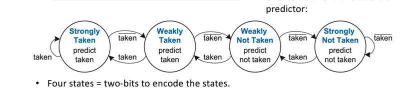

# Branch Prediction Module

## Overview
This repo contains the new Branch prediction module, and the beginning of implementing it within the Pipelined design. This was designed to improve hit rates through dynamic prediction (utilising 2 bits), and storing PC values within a table. These would then assign one of 4 states based on an fsm, allowing for higher hit rates, less risk of hazards, and a faster cycle.

### Authors
- Primary Implementation and inital logic implementation: Shreeya Agarwal

## Introduction
To enhance efficiency and hit rate, we implemented an fsm from the lecture slides, and the logic aided by the textbooks. This reduces latency, and overall processor performance.

## Design Specification

The module designed was based off of the *Harris and Harris* textbook and the following diagram.

We went for 2 bit as its more accurate, and more realistic in relation to modern CPUs.

Please see the module and Shreeyas personal statemet for further details on implementation.

## Testing
Due to time contraints we weren't able to properly test and implement this unfortunately.
 

## Potential Improvements.
 - Testing
 - proper implementation
 - Clear logic with no bugs;  would've been better done if no bugs