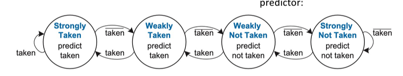
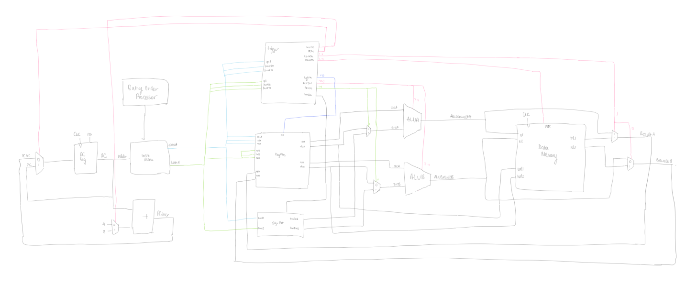

# Personal Statement
## Shreeya Agarwal

**CID**: 02455685

**Github Username**: ShreeyaAg, although due to configuration issues with not setting up properly on my laptop, my commits also come up as root.

### Overview
- PC Register
- Sign Extension Unit
- Register File
- F1 assembly code
- Flip Flop Registers
- Hazard Unit
- Memory Implementation for 2 set associative cache
- Unit Test
- Branch Prediction
- Super Scalar model
- Final Comments

### PC Register

I made the PC Register for Lab 4, and it's structure didn't need to be changed for the implementation of a single cycle CPU. Upon Pipelining however, the logic had to be changed slightly to implement Stall and Flush for data hazards through a hold.

[relevant commit](https://github.com/Abeeekoala/IAC-Team-12/commit/6c3b1b7358c998f94dce41dfea5ca52bb9e936c3)


### Sign Extension Unit

The Sign Extension from labs 4 shouldn't have had a change in structure for the single cycle CPU. However initially I didn't take into account modifying the test case for each instruction type. Since I made a general case, when it came to testing and implementing, the logic had to be updated to take into account each instruction type, which was done with the help of my teammates. The instruction types can be seen as below:

In the module, the type of instruction is determined by the ImmSrc signal.

| ImmSrc | Type |
|--------|------|
|000     | Immediate-Signed|
|001     | Immediate-Unsigned|
|010     | Store|
|011     | Branch|
|100     | Upper Immediate |
|101     | Jump |

A case statement was used to implement all of these changes.

[relevant commit](https://github.com/Abeeekoala/IAC-Team-12/commit/c8ba775cb571022c7e6e7d1b3375e4d6549ad841)


### Register File

The Register File uses multiple components to store data.

```SystemVerilog

parameter ADDR_WIDTH = 5,          // a0_width = 5
DATA_WIDTH = 32
```

Here I've defined the width of the address bus to select the registers;  ${2^{5} = 32}$ possible register addresses. The data is also 32 bits wide, which was further instantiated here:

```systemverilog
logic [DATA_WIDTH-1:0] regfile_array [2**ADDR_WIDTH-1:0];
```

We have 2 read ports which are used to select which registers to read from, and 1 write address to specify where the data is written into.

We then start the logic for *reading* and *writing*.

The **read logic** is implemented in an `always_comb` block to ensure the logic executes combinationally whenever an address input (`A1`, `A2`, `A3`) change. In the file, `a0` is a specialised output reading from register `x10`, used to represent the first arguement register so tha nothing is automatically written back into that as an automatic loop.

I ensured the logic was **asynchronous** so that the outputs changed immediately when the respective register address changes without waiting for a clock edge (good especially as reading is a fast, low-latency operation).

The **write logic** is synchronous, and the data from `WD3` would be written to the register specified by `A3` if `WE3` is high. We also check that `A3 != 5'b00000` since `x0` is hardwired to 0, and we don't want to modify that. In the pipelined version, we ensured that the write logic was changed to occur on a negative instead of a positive edge.

[relevant commit](https://github.com/Abeeekoala/IAC-Team-12/commit/1071f771711edb0e5572396be3fb4a951d05c970)

The initial lab 4 module (which was done with the aid of Charlotte) can be seen on her relevant commit.

### F1.s assembly code

The initial code I came up with:

```assembly
main:
    # initialise the light states in data memory
    li t0, 0x00100000           # base address of data memory
    sw zero, 0(t0)              # turn off all lights intitally

    #turn on light1
    li t1, 0x1                  # state of light1
    sw t1, 0(t0)                # store data in memory
    jal ra, delay               # delay before next light

    # turn on light2
    li t1, 0x3                  # light 1 and 2 state
    sw t1, 0(t0)                # store state in memory
    jal ra, delay               # delay before next light

    # turn on light 3           
    li t1, 0x7                  # light 1/2/3 state
    sw t1, 0(t0)                # store state in memort
    jal ra, delay               # delay before reset

    # turn on light 4
    li t1, 0xF                 #light 1/2/3/4 state
    sw t1, 0(t0)
    jal ra, delay

    # turn on light 5
    li t1, 0x1F                 #light 1/2/3/4 state
    sw t1, 0(t0)
    jal ra, delay

    # turn on light 6
    li t1, 0x43                #light 1/2/3/4 state
    sw t1, 0(t0)
    jal ra, delay

    # turn on light 7
    li t1, 0x7F                 #light 1/2/3/4 state
    sw t1, 0(t0)
    jal ra, delay

    # turn on light 8
    li t1, 0xFF                 #light 1/2/3/4 state
    sw t1, 0(t0)
    jal ra, delay


    # reset sequence (loop back to start)
    j main                      # restart sequence

# delay loop
delay:
    li t2, 0xFFF           # adjust delay as needed

delay_loop:
    addi t2, t2, -1             # decrement counter
    bnez t2, delay_loop         # loop until counter reaches 0
    ret                         # return to main program

    .data
    .org 0x00100             	# start of data memory

    .word 0                     # light stages (default: all of)
```

In this code, we see it cycle through the different states of lights, where the states are encoded in HEX. I incremented this in powers of 2, because we essentially add '1' to the next bit of the binary number (same as multiplying by 2), allowing each light to correspond to a specific bit in the binary number. 

My main issues were spelling mistakes, not implementing a trigger as stated by the deliverables, not beginning the *text* section and not making the *main* globally visible. This was modified in the implementation, where we used a **LSFR-7** to generate a pseudo-random sequence (with 3 stages: initialisation, feedback calculation, update). We also added delay control to ensure the *delay value* doesn't reach zero when counting down to create the delay. This logic is evidently shown in the final F1 assembly code commit made by Abraham.

[relevant commit 1 from me](https://github.com/Abeeekoala/IAC-Team-12/commit/3ab7f30c640d5fbcb227a3180767129bf0baf1bf)

[relevant commit 2 from me](https://github.com/Abeeekoala/IAC-Team-12/commit/b64a61185a786d21c7d44da136dd3595714903d3)


### Flip Flop Registers

After the implementation of single cycle was finished, we moved on to pipelining. One of the major changes to the design was the addition of the 4 flip flops, which are key to store enable parallel execution of multiple instructions.

According to the diagram given in the lecture slides, I made the initial structure for the 4 flip flops, with all the inputs and outputs and their widths. The logic was inside a block, and always synchronous.

Since the addition of the flip flops made the breakdown of the 4 stages clearer, instructions in the stage before were stored into the stage after:

e.g. fetch into decode, decode into memory etc.

Upon starting the implementation of this, we also saw it to be easier to split the top file into the 4 stages, to easily differentiate what's going on at every stage, and make our top file cleaner and less crowded. This is very evident within the final files (shown on Shravan's relevant commit).

Within the flip flops, the main thing which had to be changed was the addition of the flush and stall logic, which became clearer after the hazard unit implementation, and can be seen within the final file, and done with the help of Shravan. 

[FF1 commit](https://github.com/Abeeekoala/IAC-Team-12/commit/19960eb49c127eb8fba312b7f3663f22fb019cf8)

[FF2 commit](https://github.com/Abeeekoala/IAC-Team-12/commit/bc48cc11bfe4f1afa2fb050e8806893a4c1ec332)

[FF3 commit](https://github.com/Abeeekoala/IAC-Team-12/commit/7bf5e917995aa5e66df240162f2c5651d5a80b51)

[FF4 commit](https://github.com/Abeeekoala/IAC-Team-12/commit/ae93d84e8a015a7d10bc0a522a405b189a8dc2ad)


### Hazard Unit

The hazard unit is used to manage pipeline hazards, and ensure the correct execution of instructions without errors. Hazards arise when dependencies and conditions prevent instructions from being executed as intended.

The main hazards we had to tackle were:

**Data Hazards**
 - Read-after-Write (RAW)
    - a.k.a true dependency
    - when an instruction reads data another instruction is writing into

 - Write-after-Read (WAR)
   - a.k.a antidependency
   - when an instruction writes to a register that a previous instruction read from

- Write-after-Write (WAW)
 - a.k.a output dependency
 - when 2 instructions write to the same register

 **Control Hazards**

 These arose due to branch conditions which could cause the pipeline to potentially fetch the wrong instruction. If the processor takes the wrong value, then delays occur till the branch condition is resolved.

 **Structural Hazards**
 These occur when there's not enough hardware resources to execute an instruction. 

 **How were these tackled?**

1) Stalling - insert a `nop` to delay stages till dependencies were solved
2) Forwarding - forward data available earlier than expected (i.e. data is written back to a register or memory later in the pipeline) to avoid stalling
3) Flushing - if there's a misprediction in branch instruction, or a data dependency causing an incorrect instruction to enter the pipeline, we flush to avoid errors.

**Initial Implementation**

In my initial implementation, we see source registers from the *Decode*, and *Execute* stage, destination registers from the *Memory* and *Write-back* stage, and flags to indicate if a load is in the MEM stage, if MEM stage is writing back to a register, or WB stage is writing back to a register.

These would lead to signals for forwarding 2 signals, and if the pipeline should be stalled or flushed.

In summary, it handles load-use hazards by stalling, and control hazards by flushing.

**Main Initial Logic**

All flush, stall, and forwarding was intialised as 0.

```systemverilog
        if (RegWriteM && (RdM != 0) && (RdM == Rs1E)) begin
            ForwardAE = 2'b10; //forward from MEM to EX
        end
        else if (RegWriteW && (RdW != 0) && (RdW == Rs1E)) begin
            ForwardAE = 2'b01; //Forward from WB to EX
        end
        else begin
            ForwardAE = 2'b00;   //no forwarding
        end
```

This was responsible for the *forwarding* from the *MEM* or *WB* stages to the *EX* stage. If the EX stage requires data that is not yet written back but is available in a previous stage (MEM or WB), the data is forwarded instead of waiting for the data to be written back to the register file.


```systemverilog
    if(RegWriteM && (RdM != 0) && (RdM == Rs2E)) begin
        ForwardBE = 2'b10;
    end
    else if (RegWriteM && (RdW != 0) && (RdW == Rs2E)) begin
        ForwardBE = 2'b01;
    end
    else begin
        ForwardBE = 2'b00;
    end
```

This block was responsible for the data forwarding logic and is specifically for the second source register `Rs2E` used in the *Execute* (EX) stage. If the instruction in the EX stage depends on data that will be written back in the MEM or WB stages, this logic forwards the data from the appropriate stage (MEM or WB) to the EX stage. This helps avoid data hazards and ensures that the EX stage has the correct input values, preventing pipeline stalls.

```systemverilog
    if (MEmReadE && ((RD2E == Rs1D) || (RD2E == Rs2D))) begin
        stall = 1'b1;
    end
    else begin
        stall = 1'b0;
    end
```
This code detects a load-use data hazard and inserts a stall to delay the execution of the instruction in the EX stage until the load instruction in the MEM stage completes and writes back the data to the register file. Without this stall, the instruction in the EX stage could try to use data that hasn't yet been written back, leading to incorrect results.

`MemReadE` checks if the current instruction is a load (`lw`). `RD2E == Rs1D || RD2E == Rs2D` checks if the load instruction's data is needed by the current instruction. If a hazard is deteted, it sets `stall` to `1`.

```systemverilog
    if (branch) begin
        flush = 1;
    end
``` 

This block was to deal with control hazards which occur when the program execution path is uncertain due to a branch instruction, such as following a branch like `beq`, `jal`, or `jalr`. This logic managed the **flush** of the pipeline when a branch is taken. The flush was going to be involved in the **IF** stage, and the **ID** stage.

We then updated it and came up with a cleaner logic for the following reasons:

 - My intial logic lacked explicit flushing logic for control hazards
 - It had logic to handle **load-use hazards**, but may have conflated for different types of hazards due to shared signal names

This had clearer modularity (separating logic for data and control hazards for easier debugging and extending), a `flush` signal specifically for control hazards, and simpler logic (especially with regards to my naming conventions).

[relevant commit](https://github.com/Abeeekoala/IAC-Team-12/commit/ba859d430c970e5ccf449889c11fa3b1cf127833)

### Memory Implementation for Cache

I wanted to be more involved with the implementation and debugging aspects of this project, especially as I didn't have much of a hands on role within the memory stage of this project beyond single cycle. For this reason, once my Charlotte had finished writing up the logic for the *2 way set-associative cache*, I decided to look into implementation of this new module. 

Having split the top file into the 4 separate stages prior made this much easier. Using the schematic drawn up, I implemented the new logic by adding in *cache* inputs and outputs, as well as modifying what was going into and out of the *Data Memory*.

This then led to the modificiation of the top file, with new input signals, and a couple of new wires instantiated. 

[relevant commit](https://github.com/Abeeekoala/IAC-Team-12/commit/4189523c88e6d058b36a9cb5891b3088835246ed)

### Unit Test

Following this, the main requirements for the assignment were done. Since we had already done a test for the processor, and our layout made it very easy to debug and see what was going wrong, we didn't have to implement a lot of individual tests.

For some of the bigger units however, we decided to include tests (i.e. the *Control Unit* and the *Hazard Unit*). I had never written a test from scracth before and wasn't heavily involved with the debugging process, so this was a good way for me to understand the logic of other units which I hadn't written (i.e. the Control Unit), and also ensure we don't run into any small issues with bigger modules. 

Writing the unit test for the *Control Unit*, I fully understood the different instructions and how they were implemented, and what expected outputs would lead to, and this also helped me clarify how its inputs and outputs linked in with other modules as well. This was all written in C++, and intially I used a really bad structure, and made lots of errors which caused  weird output. I then, comparing against the structure of some of the other unit tests, matched my structure, leading to much easier debugging and clarification in what's being tested.

[relevant commit](https://github.com/Abeeekoala/IAC-Team-12/commit/2f0c20bf6192f26e34c5fe84d8a6cb51ec71cfac)

[final file](https://github.com/Abeeekoala/IAC-Team-12/blob/Pipelinedw/Cache/tb/tests/CU_tb.cpp)

To improve, I would've found a way to write this code shorter and more efficiently. However for an initial understanding of testing I was happy with this, and it allowed us to test properly.

### Branch Prediction

To go above and beyond what was expected of us I wanted to work on creating something new rather than developing a component that had already been worked on. For this reason, one of the things I decided to work upon was branch prediction. I learnt from the *Harris and Harris* textbook.

What was good about the branch prediction was that it was just a separate module to be made; implementation would've been the hard part to do. Unfortunately we didn't have time to look into this.

However, making the module taught me about how an *fsm* was key in its logic, as well as learning how to implement it.



Branch prediction guesses the outcome of a conditional branch before its executed, thereby reducing delays caused by control hazards in the pipeline.

There were 2 types: **1-bit** and **2-bit** branch predictors. Due to time constraints, and hoping to learn more as it integrates static logic anyways, I decided to create a 2-bit predictor due it having improved accuracy (especially for loops and conditional branches with occassional deviations). This would also correlate more strongly with modern CPU designs due the minimal pipeline stalls caused by misprediction.

#### How I Implemented it
 Using a **Branch Target Buffer**, I implemented  a 2-bit branch predictor which will predict if a branch is taken or not based on the PC and the history of the branches behaviour. The **BTB** entries are updated using the 4 states of the FSM.

 ```systemverilog
 state_t BTB[BTB_SIZE-1:0];
 ```
 The BTB is an *array* of `state_t` entries which are indexed by the lower bits of the PC.

 ```systemverilog
 assign prediction = (BTB[PC_out] == WT || BTB[PC_out] == ST);
 ```
 The *prediction signal* is computed by checking the state of the BTB entry corresponding to the current PC.

Inside the `always_ff` block, when `rst` is high, all the BTB entries are initialised to `SNT` as the program will have no prior branch history, and the FSM would quickly adjust the prediction based on the outcomes (easier to go from SNT to ST than the other way).

Then based on the outcome of `branch_taken`, the BTB entry for the current PC will transition between the 4 states.

In the actual design of the CPU, this module would've been an additional add on to the PCreg, which occurs in the fetch stage - for this reason I tried to update the *top*, *PC*, and *fetch* logic for implementation. Unfortunately we weren't able to test this out - to improve I would've tried to be less scared to test out full implementation by myself.

[relevant commits](https://github.com/Abeeekoala/IAC-Team-12/commit/205e1ec53324ae6398e98385ac16a2444281ca58#diff-f7f7460cddb74c98d1bddb91812bc84fe4b52273fbfb7504a81b42608d88741bR43)

[final branch prediction module](https://github.com/Abeeekoala/IAC-Team-12/blob/Branch-prediction/modules/branchprediction.sv)

### SuperScalar Model

By the end of working on this project, the thing I was most keen on learning and applying as close as possible how modern CPUs are made. The CPU we were tasked with building was scalar; why not scale this to make it superscalar?

The main benefit of the superscalar model would've been the faster processing of instructions, and its  design and model had piqued my interest quite a lot. Unfortunately, we didn't have time to properly debug and integrate, but it allowed me to understand all the components used within the CPU, and how to rewrite them by myself and understand each module I hadn't worked on previously deeper.

I decided to work on a single cycle design, implementing the basic ALU instructions. In the intial design I made, aided through the *Harris and Harris* textbook, the first changes to implement were doubling the number of *read* and *write* ports, and understanding which signals from the *control unit* controlled what.



Initially in the design, I wanted to just double up the number of bits of each signal, and each mux. However, this proved to be difficult to keep track of upon implementation, so I decided to keep the signals the same width as before and just double the number of signals.

The first thing I modified was the `control unit`. I based the module on Shravan's initial model from the scalar model. However, I found it was long, and implemented every test case individually - it was hard finding the specific instructions I wanted to remove, and tedious to work through (especially when making my `CU_tb.cpp` from before).

Therefore for each type of instruction (e.g. *r-type*, *i-type*) I rewrote the code like this following code snippet:

```systemverilog
    // Process instruction A
        case(opA)
            // r-type instructions
            7'b0110011: begin
                RegWriteA = 1'b1;
                case(funct3A)
                    3'b000: ALUctrlA = funct7_5A ? 4'b0001 : 4'b0000; // ADD or SUB
                    3'b100: ALUctrlA = 4'b0100; // XOR
                    3'b110: ALUctrlA = 4'b0011; // OR
                    3'b111: ALUctrlA = 4'b0010; // AND
                    3'b001: ALUctrlA = 4'b0101; // SLL
                    3'b101: ALUctrlA = funct7_5A ? 4'b0111 : 4'b0110; // SRL or SRA
                    3'b010: ALUctrlA = 4'b1001; // SLT
                    3'b011: ALUctrlA = 4'b1010; // SLTU
                endcase
            end
```

This code snippet was much shorter, and since I was doubling up on the signals and number of cases, made it much easier to debug and keep track of what was going on.

[final CU file](https://github.com/Abeeekoala/IAC-Team-12/blob/Superscalar/modules/CU.sv)

Next I worked on the `Register File` and `Instruction Memory`. This followed a similar structure to the implementation in the scalar model, I just had to double up on the read and write ports for the 2 instructions to work simultaneously. In the `InstrMem`, I found it useful to extract the fields for both instructions, and assign the signals with the respective bit lengths of the signals they were receiving. This made trying to implement the code cleaner, and bring more structure. 

A similar approach was implemented for the `datamemory` module.

Then within the PCReg, I found I didn't have to change much, but within the top file, I had to implement an option for `PC_Plus_4` and `PC_Plus_8`. In a superscalar processor, multiple instructions are fetched and executed in parallel to enhance performance. Using increments like `PC+4` and `PC+8` aligns with the fixed instruction size (e.g., 32-bit) and enables simultaneous fetching of consecutive instructions for parallel pipelines. This approach simplifies hardware design, ensures efficient instruction alignment, and minimizes delays, supporting the processor's ability to keep multiple execution units busy without stalling. The implementation is clear in the top and PC files.

[implementation](https://github.com/Abeeekoala/IAC-Team-12/blob/Superscalar/modules/PC.sv)

The `ALU` structure remained the same - again I initially tried to double the bits on 1 ALU, but this was harder to implement, so I didn't change its structure much. Having 2 ALUs ensures reduced bottlenecks, load balancing and parallel execution. I decided to implement 2 instances within the top level.

These were the changes to the *single cycle* model. The main additional change was the `Out of Order` (**OoO**) processor. In pipeling, we saw we had to implement a hazard unit to take care of hazards caused by instructions executing in parallel. In a superscalar model, the **OoO processor** executes instructions based on the availability of input data and execution units rather than strictly following the program's initial sequence (in-order execution). This maximizes resource utilisation and improves performance by exploiting instruction-level parallelism, and reducing latency.

The main components are:

1) Instruction Queues (dependency tracking)

```cpp
std::unordered_map<int, std::vector<int>> build_dependency_graph(const std::vector<Instruction>& instructions) {
    std::unordered_map<int, std::vector<int>> graph;
    std::unordered_map<std::string, int> last_written;

    for (const auto& instr : instructions) {
        graph[instr.id] = {};
    }

    for (size_t i = 0; i < instructions.size(); ++i) {
        const auto& instr = instructions[i];

        // Check for dependencies
        for (const auto& src : instr.src) {
            if (last_written.count(src)) {
                graph[last_written[src]].push_back(instr.id); // RAW dependency
            }
        }

        // Update last written for WAR/WAW dependencies
        last_written[instr.dest] = instr.id;
    }

    return graph;
}
```

This function would create a dependency graph by tracking which instructions produce and consume specific registers.

2) Instruction Scheduler (dynamic scheduling)

In the code snippet following for the `build_dependency_graphs`, I utilised topological sorting to consider instruction latencies; this reorders instructions based on readiness and resource availability.

3) Latency Awareness
```cpp
std::unordered_map<int, int> latencies;
for (const auto& instr : instructions) {
    latencies[instr.id] = instr.latency;
}
```

The `latencies` map holds the execution time for each instruction, which influences the scheduling process. This models execution unit delays, ensuring the scheduler accounts for instruction latencies when determining execution readiness.

4) Correctness and Reordering
```cpp
for (int id : sortedIds) {
    const auto& instr = *std::find_if(instructions.begin(), instructions.end(),
                                      [id](const Instruction& instr) { return instr.id == id; });
    std::cout << "Instruction " << instr.id << ": " << instr.op << " " << instr.dest << " <- ";
    for (const auto& src : instr.src) {
        std::cout << src << " ";
    }
    std::cout << std::endl;
}
```
After scheduling, instructions are output in the new execution order.

5) Handling Cyclic Dependencies
```cpp
if (sortedOrder.size() != graph.size()) {
    throw std::runtime_error("Cyclic dependencies found!");
}
```

This ensures no cyclic dependencies in the instruction graph, which could cause a deadlock in execution. Cyclic dependencies occur when 2 or more instructions depend on each other, creating a loop in the dependency graph and causing an infinite wait. This is done through the topological sort from earlier.

[final OoO](https://github.com/Abeeekoala/IAC-Team-12/blob/Superscalar/modules/OoO.cpp)

Throughout the implementation of this model, I learnt how to adapt a pre-existing design, adapt modules, and rewrite code in a more efficicient structure and manner. I also learnt how to integrate different blocks of code together, and work on modules I didn't work on before. It also gave me a more hands on role with testing and debugging as I worked more independently on this design to try get it working. By the end of this, despite it not working, I can say I understood how a superscalar model works.

To improve on this, I would've been more structured in the implementation of the design - if I hadn't been as confused in the way I worked, I am confident I could've made progress than I did. This includes making a more cohesive top file, and an F1 assembly.

[relevant commit](https://github.com/Abeeekoala/IAC-Team-12/commit/f89c1dfc04c88aaf592b945063b583b3e30596c8)

All final files can be found on the [superscalar branch](https://github.com/Abeeekoala/IAC-Team-12/tree/Superscalar)

### Final Comments

I took on the role of writing the bulk of the team statement, as I enjoy and want to develop my technical writing skills further. This ensured we could document the overall CPU's progress in an orderly fashion, save my teammates time and have it aid their personal statements. Since I spoke in enough detail aboout the process and components in the initial commit, it ensured I had a working understanding of all parts of the CPU and its architecture - something I was keen on doing as I wanted to understand components I didn't have major contribution to either (e.g. components in the memory stage). 

I enjoyed working with my team, and on this project, and can confidently say I learnt a good amount about RISC-V, SystemVerilog and hardware design. There are lots of transferrable skills to take forward, and I liked how this built up on my knowledge from *EEP1 Assembler* in 1st year, and the labs and lectures from the IAC module itself. From the team members themselves, I also learnt a lot about their thought processes, and how I can better myself as an engineer. My Git skills were non existent before - I look forward to working collaboratively on this platform again.

To improve, I would've encouraged clearer communication from myself on wanting to work more on top level implementation (in the pace of working to finish, I feel others took on the role due to more initiative).

In the final push, to go above and beyond I should've worked on just one extra thing rather than two, and actually got it implemented properly and working. 

However, I'm also happy I did this, as I learnt a lot from doing both and understood the big picture level; something I'm not sure I would've done in my own time, and now feel comfortable applying the logic for similar things in the future. Working on both has also encouraged me to finish the working models in my own time as I was so close but just needed my thoughts more structured and organised.

To have improved on that, I would've tackled these projects with a much clearer step by step plan, and documenting my thoughts rather than getting myself confused.

It is also to note, as I had a fever in the last couple days before the deadline so I wasn't to do that final push of work to potentially get the Super Scalar model working. 
